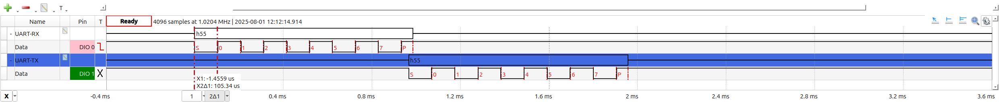
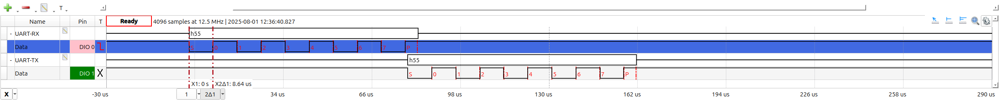

# FPGA-based UART Implementation

This repository provides a simple, parameterizable **UART (Universal Asynchronous Receiver/Transmitter)** module implemented in **SystemVerilog** for FPGA and ASIC designs. It combines both **transmit (TX)** and **receive (RX)** functionality in a single RTL block.

## Features

- Combined **TX and RX** UART interface
- **Parameterizable clock frequency** (`CLK_FREQ`) and **baud rate** (`BAUD_RATE`)
- Standard **8N1 format** (8 data bits, no parity, 1 stop bit)
- **Asynchronous input synchronization** for reliable RX operation
- Simple **handshaking signals** (`tx_start`, `tx_busy`, `rx_ready`)
- Synthesizable on most FPGAs and ASIC designs

## Interface

### Parameters

| Parameter   | Default      | Description                       |
| ----------- | ------------ | --------------------------------- |
| `CLK_FREQ`  | `50_000_000` | System clock frequency in Hz      |
| `BAUD_RATE` | `9600`       | UART baud rate in bits per second |

### Inputs

| Signal     | Width | Description                           |
| ---------- | ----- | ------------------------------------- |
| `clk`      | 1     | System clock                          |
| `rst_n`    | 1     | Active-low reset                      |
| `tx_start` | 1     | Pulse to start transmitting `tx_data` |
| `tx_data`  | 8     | Byte to transmit                      |
| `rx`       | 1     | UART RX line (serial data input)      |

### Outputs

| Signal     | Width | Description                                             |
| ---------- | ----- | ------------------------------------------------------- |
| `tx`       | 1     | UART TX line (serial data output)                       |
| `tx_busy`  | 1     | High while a byte is being transmitted                  |
| `rx_data`  | 8     | Byte received from RX line                              |
| `rx_ready` | 1     | Pulse indicating `rx_data` contains valid received byte |

---

## Usage

- Assert `tx_start` for **one clock cycle** with `tx_data` valid to transmit a byte.
- Monitor `rx_ready` to know when a byte has been received.

## Notes

- Current implementation assumes:

  - **8N1 framing** (8 data bits, 1 start bit, 1 stop bit, no parity).
  - Only **one-byte buffer** for TX and RX. If data is not read before the next byte arrives, data may be lost.

- No error detection (framing/parity errors) is implemented.
- For high-reliability applications:

  - Consider adding **oversampling** for RX.
  - Use a **FIFO buffer** for RX/TX.
  - Implement **parity and framing error detection**.

## Simulation (Verilator + Cocotb)

This repository includes a **Python-based testbench** and a **Makefile** for Verilator-based simulation.

### Requirements

- [Verilator](https://www.veripool.org/verilator/) (latest stable version)
- [Cocotb](https://docs.cocotb.org/) (Python-based testbench framework)
- `gtkwave` (optional, for viewing waveforms)
- `genhtml` (optional, for generating HTML coverage reports)

### Running Simulation

From the `sim/` directory:

```bash
make runall
```

This will:

1. Clean previous builds
2. Build the Verilator model
3. Run all Cocotb testcases (`test_uart.py`)
4. Generate a coverage report (HTML format in `coverage_html/`)
5. Launch GTKWave (if available)

### Manual Commands

- `make` → Build and run simulation
- `make wave` → View waveform (`dump.fst`) in GTKWave
- `make coverage` → Generate HTML coverage report

## Hardware Validation

This UART RTL design has been **tested and validated on real hardware** using:

- **FPGA:** Altera® MAX® 10 (10M08) Evaluation Kit
- **Clock Frequency:** 50 MHz
- **Baud Rate Tested:** 9600 & 115,200 bps (8N1 format)
- **Measurement Equipment:** Digilent **Analog Discovery 2** (Logic Analyzer & Oscilloscope)
- **Setup:**

  - FPGA UART connected in **loopback configuration** with a **PC UART interface**.
  - Data transmitted and received at 9600 baud.
  - TX and RX waveforms observed using Analog Discovery 2.

### Oscilloscope Capture

Below is an oscilloscope capture showing **TX (yellow)** and **RX (blue)** waveforms during transmission of a single byte (`0x55`).
Measurement performed using **Digilent Analog Discovery 2**. Successful transmission and reception of multiple bytes without errors confirms the correct operation on hardware. Below is oscilloscope captures for the **TX** and **RX** waveforms during transmission of a single byte (`0x55`). Measurement was performed using a [Digilent Analog Discovery 2](https://digilent.com/shop/analog-discovery-2-100ms-s-usb-oscilloscope-logic-analyzer-and-variable-power-supply/) device.

<div align="center">
  
</div>
<p align="center"><em>Figure 1: Slow UART TX/RX (9600) waveform during a single-byte transmission (`0x55`).</em></p>

<div align="center">
  
</div>
<p align="center"><em>Figure 1: Fast UART TX/RX (115,200) waveform during a single-byte transmission (`0x55`).</em></p>

### Time Analysis

- Measured bit duration on oscilloscope:

  $$
  T_{bit,slow} \approx 105.43 \,\mu s
  $$

  $$
  T_{bit,fast} \approx 8.64 \,\mu s
  $$

- Expected bit duration at **9600, 115200 baud:**

  $$
  T_{bit,slow} = \frac{1}{9600} \approx 104.167 \,\mu s
  $$

  $$
  T_{bit,fast} = \frac{1}{115,200} \approx 8.681 \,\mu s
  $$

- **Relative error:**

  $$
  e_{slow} = \frac{|105.43 - 104.167|}{104.167} \times 100 \approx 1.13\%
  $$

  $$
  e_{fast} = \frac{|8.64 - 8.681|}{8.681} \times 100 \approx 0.47\%
  $$

This deviation is expected due to integer clock divider rounding (50 MHz ÷ 9600 ≈ 5208.33)(50 MHz ÷ 115,200 ≈ 434.03).
An error below **±2%** is well within standard UART tolerance limits (typically ±5%).

## License

This project is released under the MIT License. See [LICENSE](LICENSE) for details.
